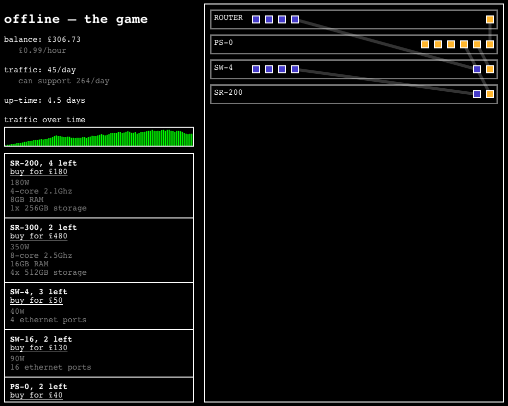

# js13k

This is my [js13k](http://js13kgames.com/) entry. The theme this year is "offline", so I decided to make a game in which you create a server network by attaching routers, servers, PSUs, and switches.

## Stuff to do

 - Upgrading specific parts of machines
 - Pay for internet and rent
 - Choosing an electricity/internet plan
    - Faster internet increases traffic
 - Upgrading rack space
    - Pay more rent for more space
 - Add some kind of goal/way to lose
